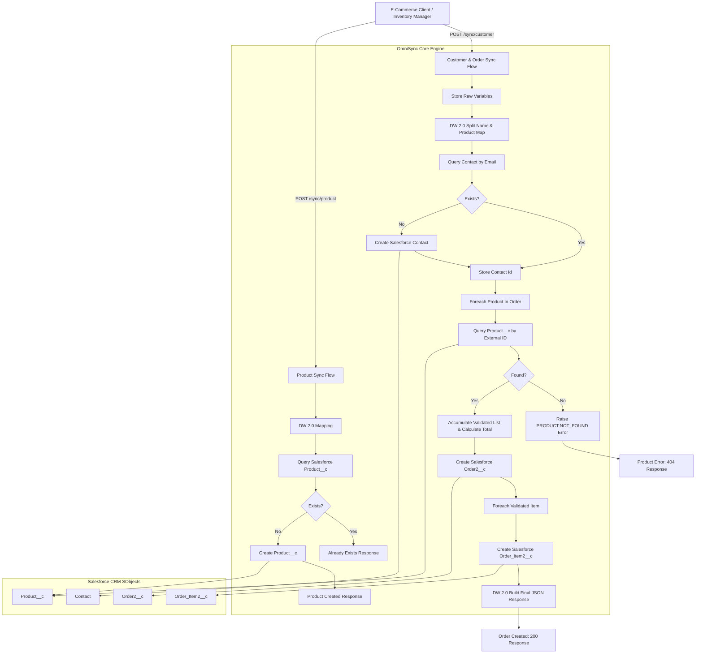
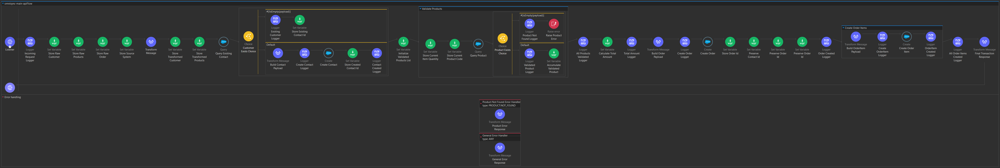
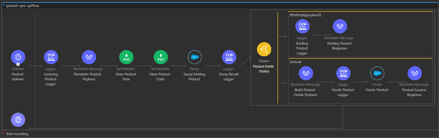

# 🚀 OmniSync API

OmniSync is a MuleSoft 4 integration project designed to connect external webstores and inventory managers with **Salesforce CRM**. It automates customer data synchronization, handles product catalog updates, and processes new orders by verifying inventory items and storing related records in Salesforce.

---

## 💻 Tech Stack
*   **MuleSoft 4** (Integration runtime)
*   **Salesforce CRM** (Data storage)
*   **DataWeave 2.0** (Data mapping and transformation)
*   **Anypoint Studio** (Development environment)
*   **Postman** (API testing)
*   **Java** (Underlying platform)
*   **HTTP Connector** (REST API listener)
*   **Salesforce Connector** (CRM database communication)

---

## ✨ Project Features
*   **Customer Deduplication**: Looks up existing Salesforce Contact records by email to avoid duplicates.
*   **Product Inventory Validation**: Verifies Order Items against inventory records before proceeding.
*   **Multi-Product Order Processing**: Processes multiple Order Items simultaneously within a single payload.
*   **Dynamic Total Calculation**: Aggregates the unit prices of valid Order Items to calculate the final order total.
*   **Salesforce Relational Object Creation**: Creates parent `Order2__c` and child `Order_Item2__c` records with clean lookup relationships.
*   **Error Handling for Invalid Products**: Identifies unrecognized product codes and returns clean, mapped error responses.
*   **Product Synchronization Endpoint**: Creates new inventory entries dynamically if they do not already exist.
*   **Order & Order Item Orchestration**: Manages the complete lifecycle from request parsing to relational CRM storage.

---

## 📐 System Architecture & Message Flow

Below is the conceptual architecture of the OmniSync Integration Engine, showcasing how incoming client requests map through MuleSoft components to target Salesforce SObjects:



---

## 📂 Repository Structure
```text
src/main/mule/          # Mule XML flow configuration files
src/main/resources/     # Resource files, including log4j2 config
README.md               # Project documentation
pom.xml                 # Maven build and dependency config
mule-artifact.json      # Mule app metadata config
```

---

## 👥 Contributions

The project is collaboratively developed by **[jkplearner](https://github.com/jkplearner)**, **[bhuvansai-16](https://github.com/bhuvansai-16)**, and **[varikuntlasaimanoj](https://github.com/varikuntlasaimanoj)** as a Salesforce–MuleSoft integration project focused on customer synchronization, inventory validation, and transactional order processing.

### 👤 [jkplearner](https://github.com/jkplearner)

* **Customer & Contact Synchronization**: Implemented customer lookup, duplicate prevention, and Salesforce Contact creation workflows.
* **Inventory Validation Flow**: Built the validation loop for verifying ordered products against Salesforce inventory records before order processing.
* **Salesforce Schema Design**: Created and configured custom Salesforce SObjects (`Product__c`, `Order2__c`, and `Order_Item2__c`) along with lookup relationships and field mappings.

### 👤 [bhuvansai-16](https://github.com/bhuvansai-16)

* **Product Synchronization API**: Developed the `/sync/product` integration flow for inventory synchronization and duplicate product prevention.
* **Order Processing Engine**: Implemented order total calculation, Order creation, and relational Order Item creation workflows.
* **DataWeave Transformations & Error Handling**: Wrote DataWeave mappings for payload transformation and configured application-level error handling and HTTP routing.

### 👤 [varikuntlasaimanoj](https://github.com/varikuntlasaimanoj)

* **API Testing & Validation**: Designed and executed Postman-based integration test scenarios covering successful transactions, duplicate validation, and invalid inventory cases.
* **Project Documentation & Flow Monitoring**: Prepared execution walkthroughs, screenshot documentation, and monitored Mule flow execution through standardized logging.
* **Deployment & Repository Management**: Assisted in project packaging, GitHub repository organization, runtime configuration, and deployment preparation.


## 🔌 API Endpoints & Specification

The API exposes two endpoints running on port `8081` by default:

### 1. Product Synchronization
*   **Endpoint**: `POST /sync/product`
*   **Purpose**: Registers new products in the Salesforce CRM master catalog.
*   **Request Payload Example**:
    ```json
    {
      "product": {
        "productCode": "PROD-999-XYZ",
        "name": "Enterprise Super Widget",
        "category": "Automation",
        "price": 149.99,
        "stockQuantity": 250,
        "status": "In Stock",
        "description": "Premium automation widget for enterprise scale."
      },
      "sourceSystem": "OMS-Inventory"
    }
    ```
*   **Successful Response Example**:
    ```json
    {
      "status": "Product Created Successfully",
      "productId": "01t8W000004vABCD12",
      "success": true
    }
    ```
*   **Duplicate Product Response Example**:
    ```json
    {
      "status": "Product Already Exists",
      "existingProduct": {
        "Id": "01t8W000004vABCD12",
        "Product_Name__c": "Enterprise Super Widget",
        "External_Product_ID__c": "PROD-999-XYZ"
      },
      "success": false
    }
    ```

### 2. Customer & Order Synchronization
*   **Endpoint**: `POST /sync/customer`
*   **Purpose**: Synchronizes customer details, validates ordered products against inventory, creates Orders, and posts Order Items.
*   **Request Payload Example**:
    ```json
    {
      "customer": {
        "fullName": "Jane Doe",
        "email": "jane.doe@example.com",
        "phone": "+1-202-555-0143"
      },
      "products": [
        {
          "productCode": "PROD-999-XYZ",
          "quantity": 3
        }
      ],
      "order": {
        "paymentStatus": "Paid"
      },
      "sourceSystem": "Shopify-Store"
    }
    ```
*   **Successful Response Example**:
    ```json
    {
      "status": "Order Created Successfully",
      "success": true,
      "contactId": "0038W00002YvABCQA3",
      "orderId": "a008W00000XYZabcQ1",
      "totalAmount": 449.97,
      "sourceSystem": "Shopify-Store",
      "itemsOrdered": 1,
      "orderItems": [
        {
          "productId": "01t8W000004vABCD12",
          "productName": "Enterprise Super Widget",
          "quantity": 3,
          "unitPrice": 149.99,
          "totalPrice": 449.97
        }
      ]
    }
    ```
*   **Error Response Example (Product Not Found)**:
    ```json
    {
      "status": "Product Not Found",
      "message": "One or more products do not exist in the inventory. Please check product codes.",
      "success": false
    }
    ```

---

## 🧪 API Testing
*   **Postman for Testing**: The application has been fully tested using Postman.
*   **Example Payloads**: Standard JSON payloads for both product synchronization and order synchronization are provided in the endpoint section above.
*   **Verification**: Visual execution results showing successful Salesforce records creation and standard error payload responses are captured in the screenshots section.

---

## 🛠️ Installation & Setup

### Prerequisites
1.  **Anypoint Studio 7.x** with **Mule Runtime 4.4.0+**
2.  **Java SE JDK 8 or 11**
3.  **Salesforce Developer Edition Org** containing custom objects:
    *   `Product__c` (fields: `Product_Name__c`, `Price__c`, `External_Product_ID__c`, `Category__c`, `Stock_Quantity__c`, `Product_Status__c`, `Product_Description__c`, `Source_System__c`, `Product_Active__c`)
    *   `Order2__c` (fields: `Customer__c` (Lookup), `Order_Date__c`, `Payment_Status__c`, `Source_System__c`, `Total_Amount__c`)
    *   `Order_Item2__c` (fields: `Order__c` (Lookup), `Product__c` (Lookup), `Quantity__c`, `Unit_Price__c`, `Source_System__c`, `Item_Status__c`)

### Steps to Run
1.  Clone the repository to your local machine:
    ```bash
    git clone <repo-url>
    ```
2.  Open **Anypoint Studio**, select `File > Import > Anypoint Studio > Packaged mule application (JAR)` or `Existing Mule Project`, and select the cloned directory.
3.  Configure your Salesforce Credentials in the config element in `src/main/mule/omnisync-main-api.xml` (or migrate them to a secure properties file):
    ```xml
    <salesforce:basic-connection
        username="${sfdc.username}"
        password="${sfdc.password}"
        securityToken="${sfdc.token}" />
    ```
4.  Right-click the project folder and select **Run As > Mule Application**.
5.  Use a client like Postman or Curl to send JSON payloads to `http://localhost:8081/sync/product` and `http://localhost:8081/sync/customer`.

---

## 🔮 Future Enhancements
*   **Stock Deduction**: Automatically update product inventory levels when an order is created.
*   **Order Cancellation**: Build an endpoint to mark orders as canceled and release associated inventory.
*   **API Security**: Implement OAuth 2.0 or Client ID enforcement for secure access to the endpoints.
*   **CloudHub Deployment**: Deploy the application to MuleSoft CloudHub for centralized deployment and monitoring.

---

## 📊 Salesforce Objects Used
*   **Contact**
*   **Product__c**
*   **Order2__c**
*   **Order_Item2__c**

---

## 📸 Visual Execution & Flow Walkthroughs

This section presents the visual design and execution outcomes of the OmniSync Integration Engine, showcasing the MuleSoft visual flows in Anypoint Studio and live Postman execution results.

### 🔌 MuleSoft Application Visual Flows

#### 1. Customer & Order Synchronization Flow (`omnisync-main-apiFlow`)
The primary transaction processing pipeline in Anypoint Studio. This flow handles multi-phase execution: raw variable storage, DataWeave parsing, Salesforce Contact query/create, validation loops, Order/Order Item record creation, and final JSON response building.



#### 2. Product Catalog Synchronization Flow (`product-sync-apiFlow`)
The dedicated endpoint flow for syncing inventory catalog items. It transforms input, verifies whether the product code exists in the inventory, and dynamically creates the catalog record in Salesforce.



---

### 🚀 Live Postman Execution & Result Captures

The following captures demonstrate the execution results of the integration test cases, showing real-time payloads, status codes, and successful Salesforce write confirmations.

#### 📁 Test Case 1: Add New Product to Inventory
This screenshot captures the `/sync/product` endpoint successfully validating that a product code is unique and inserting the record into the Salesforce `Product__c` object.


#### 📁 Test Case 2: Duplicate Product Rejection
This screenshot demonstrates duplicate catalog checking. When the same product code is synchronized a second time, the flow detects the collision and safely rejects it, returning the existing product ID.


#### 📁 Test Case 3: Successful Order for New Customer (Single Product)
This screenshot captures the end-to-end integration of a new customer purchase. It creates the Salesforce `Contact`, queries the product, calculates the totals, and creates the order and single order item relationships.


#### 📁 Test Case 4: Successful Order for Existing Customer (Multiple Products)
This screenshot validates a larger transaction. The system recognizes the existing customer's contact record (preventing duplicates) and processes an order consisting of multiple valid products, correctly aggregating the total cost.


#### 📁 Test Case 5: Product Validation Failure (Invalid Product)
This screenshot illustrates system resilience. If a transaction contains a product code that does not exist in the master inventory, the engine blocks the order, raises a `PRODUCT:NOT_FOUND` error, and returns a clean `404` error payload.


---

## 📌 Project Status
*   ✅ Core integration workflow completed
*   ✅ Product synchronization completed
*   ✅ Customer & order orchestration completed
*   ✅ Salesforce relational mapping completed
*   ✅ Error handling and validation completed
